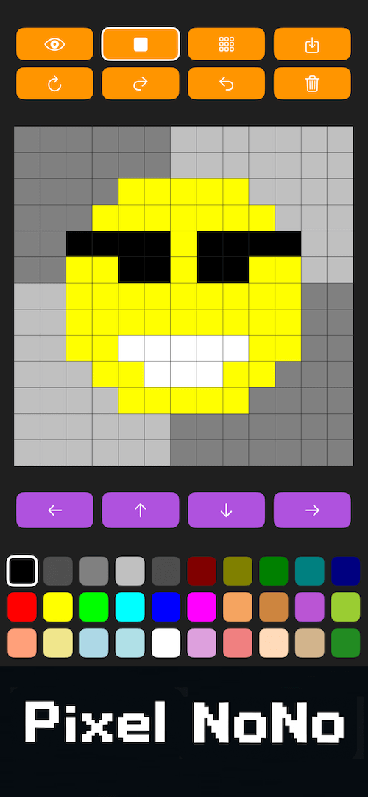
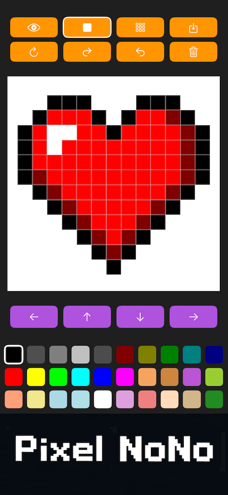
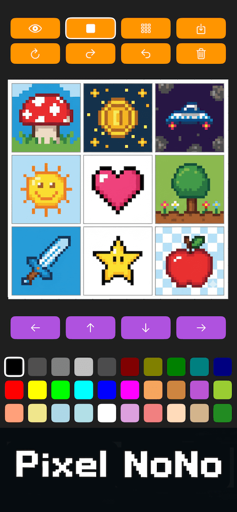

# 🦖 Pixel NoNo: No True Try – No Pixel Art
### Create Cute Pixel Art • Simple • Fun • 24×24 Canvas

## 🎨 About the App
**Pixel NoNo – Pixel Art Maker** is a delightful and easy-to-use pixel drawing app designed for everyone — from beginners to pixel art enthusiasts.  
Choose from **30 professional pixel colors**, draw freely, and bring your ideas to life on the standard **24×24 pixel canvas**.

> Unleash your creativity with Pixel Dino – the easiest and most delightful way to draw Pixel Art.

### ✨ Features
- 🟩 **30 professional pixel colors**
- 🧩 **Standard 24×24 canvas**
- 🎨 **Beginner-friendly, clean interface**
- 🖼 **Perfect for icons, stickers, characters, and pixel experiments**

---

## 📸 Screenshots

| | | |
|---|---|---|
|  |  |  |

---

## 📲 Download on the App Store  
👉 **https://apps.apple.com/app/pixel-dino-pixel-art-maker/id6755783643**

---

## 🛠 Technologies
- Swift / SwiftUI  
- iOS 17+  
- Optimized real-time pixel drawing engine  

---

## 🧩 Support
Have a suggestion or found a bug?  
Please open an **Issue** or contact through the App Store.

---
